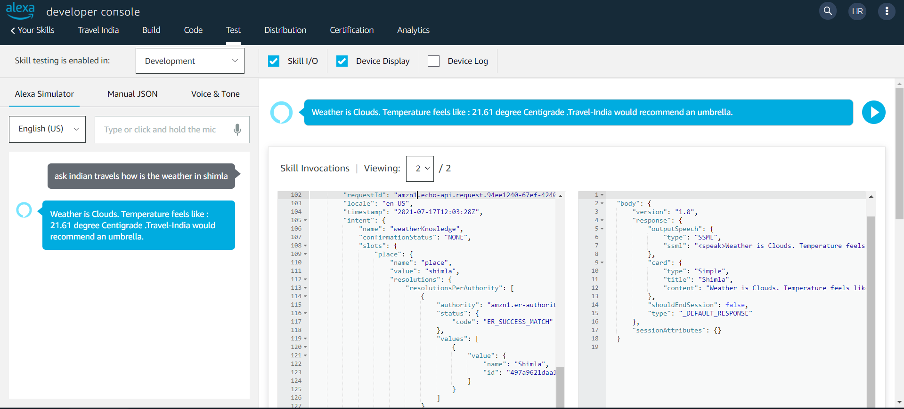
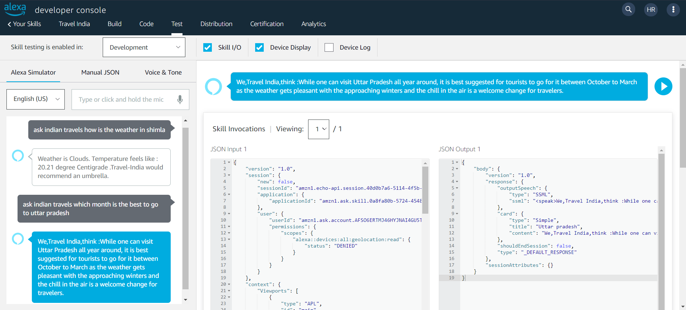

# TravelIndia
## [DEMO-Video](https://vimeo.com/576245271)
Travel India is a small approach towards making tourism a little bit easy for foreign travelers using voice app of Amazon Alexa.

AlexaSkill.js is the main file which handles all the requests for the AWS Lambda function. This skill has been developed with Node.JS v.12
on AWS Lambda.

Multiple JSON files in this respository are mainly input Data files to test out commands and multiple intents of the skill.

